# Bản đồ chức năng (Feature Map)

> Tổng hợp chức năng Synaptek theo trạng thái. **✅ đã ship · ⏳ chưa ship/dang dở · 🔮 tương lai.**
> Nguồn chi tiết: `docs/02-roadmap.md` (milestone) · `docs/00-architecture.md §0` (Decision Log) · `docs/WORKING-NOTES.md` (điểm tiếp tục).

## Mindmap

```mermaid
mindmap
  root((Synaptek<br/>Toán Tiểu học+))
    🧠 Moat chấm (grading-engine)
      ✅ 9 loại grade(): mcq · true-false · numeric · fraction
      ✅ expression · fill-blank · multi · ordering · matching
      ✅ +2 loại orchestrate riêng: derivation (từng bước) · compound (nhiều phần, có thể lồng derivation)
      ✅ Số VN · hỗn số · % · đơn vị đo · số La Mã · căn bậc hai √/sqrt()
      ✅ Tương đương biểu thức qua lấy mẫu (D9, không CAS)
      ✅ 6 chẩn đoán lỗi (sai dấu/lệch10/đảo phân số/làm tròn/lệch1/đảo chữ số)
      ✅ Client tức thì + Server ẩn đáp án (D4)
    🎒 Học sinh
      M1 Luyện tập ✅
        ✅ Đa môn (Toán lớp 1-5 + Tiếng Việt lớp 1-3)
        ✅ Chấm tức thì + giải thích + gợi ý
        ✅ Bàn phím toán có cấu trúc (mũ/ngoặc/biến/căn)
      M2 Mastery & Lộ trình ✅
        ✅ Mastery BKT + lộ trình + heatmap
        ✅ Gamification XP/streak/huy hiệu/avatar theo XP
        ✅ Ôn ngắt quãng + sổ tay lỗi (ôn lại câu sai)
        ✅ Mục tiêu hằng ngày + luyện nhanh + BXH lớp
        ⏳ Push nhắc thật — chờ M5 (projectId EAS)
    🧑‍🏫 Giáo viên M3 ✅
      ✅ Lớp + mã mời + roster + sửa/xóa bài + đổi vai trò
      ✅ Giao bài (giới hạn nộp/pool ngẫu nhiên/giao đích danh)
      ✅ Chấm chính thức ẩn đáp án + ghi đè + nhận xét
      ✅ Báo cáo lớp + cảnh báo HS yếu + xu hướng + xuất CSV
      ✅ Soạn câu 11 loại (đủ bộ engine) + ảnh + gợi ý + tùy chọn chấm
    👪 Phụ huynh M4 ✅
      ✅ Liên kết PH-con (mã) + theo dõi read-only
      ✅ Gợi ý ôn điểm yếu + giao bài tại nhà
    ⚙️ Hạ tầng
      ✅ Monorepo + CI 3-gate (verify/RLS/e2e-auth) + Spec Kit
      ✅ Supabase BaaS + Edge Functions, deploy auto Web+Backend
      ⏳ cron review-scheduler lên lịch hosted thật
      🔮 M5 Native (EAS build/push/offline/store) — chặn bởi tài khoản
    🤖 Gia sư AI
      ✅ MVP: giải thích khi HS sai (Gemini, engine vẫn chấm)
      ⏳ chờ GEMINI_API_KEY thật — chỉ code/wiring, không cần key để hoàn thiện
      🔮 mở rộng phạm vi (chat tự do, màn khác ngoài luyện tập)
    🔐 Auth & quản lý người dùng
      ✅ Đăng nhập/đăng ký email-mật khẩu + đăng xuất + đổi vai trò
      ✅ Đổi mật khẩu khi đã đăng nhập (xác thực lại mật khẩu hiện tại)
      ✅ Quên mật khẩu (Resend SMTP, chống dò email) — TẠM DỪNG vì chưa có domain
      ✅ Đổi tên hiển thị · đăng xuất thiết bị khác · avatar ảnh thật (thêm, cạnh emoji-XP)
      ✅ Xóa tài khoản (soft delete, GV còn lớp có HS bị chặn)
      ⏳ chờ chủ repo mua domain → verify Resend → RESEND_API_KEY
      🔮 xác thực email · đổi email khi đã đăng nhập
      🔮 social login · MFA
    🔭 Tương lai xa
      🔮 THCS/THPT sâu hơn (chưa bắt đầu)
      🔮 Môn khác đầy đủ Lý/Hóa/Anh (mới có nền đa môn)
      ✅ LaTeX render (KaTeX, web-only) cho câu hỏi/lời giải
      🔮 LaTeX-as-input (gõ trực tiếp) — chủ đích chỉ hợp THCS/THPT
      🔮 Gia sư AI mở rộng (chat tự do) — cần quyết định an toàn sản phẩm trước
```

## Theo trạng thái (flowchart)

```mermaid
flowchart LR
  S([Synaptek])
  S --> SHIPPED["✅ Đã ship"]
  S --> WIP["⏳ Chưa ship / dang dở"]
  S --> FUTURE["🔮 Tương lai"]

  SHIPPED --> A1["Moat: 11 loại câu, chấm tương đương<br/>client + server ẩn đáp án"]
  SHIPPED --> A2["M1 HS: luyện tập đa môn + chấm tức thì + bàn phím toán"]
  SHIPPED --> A3["M2: BKT · lộ trình · heatmap · gamification · avatar/BXH · ôn ngắt quãng"]
  SHIPPED --> A4["M3 GV: lớp · giao bài · chấm chính thức · ghi đè · phân tích · RLS"]
  SHIPPED --> A5["Giới hạn nộp bài (hạn/số lần/timer) + pool ngẫu nhiên + giao đích danh"]
  SHIPPED --> A6["Deploy hosted AUTO: Vercel + Supabase"]
  SHIPPED --> A7["M4 Phụ huynh: liên kết PH-con + theo dõi + gợi ý ôn + giao bài tại nhà"]
  SHIPPED --> A8["Authoring: 11 loại câu tự soạn (kể cả từng bước, nhiều phần, căn bậc hai)"]
  SHIPPED --> A9["Nội dung 205 câu, 5 lớp Toán + 3 lớp Tiếng Việt"]
  SHIPPED --> A10["Ôn lại câu sai + phản hồi lỗi thông minh + xem lời giải"]
  SHIPPED --> A11["GV sửa/xóa bài tự soạn · HS/GV/PH đổi vai trò"]
  SHIPPED --> A12["Gia sư AI MVP: giải thích khi HS sai (Gemini, engine vẫn chấm)"]
  SHIPPED --> A13["Quên mật khẩu: link khôi phục qua Resend SMTP, chống dò email"]
  SHIPPED --> A14["Đổi mật khẩu khi đã đăng nhập: xác thực lại mật khẩu hiện tại trước khi đổi"]
  SHIPPED --> A15["Tự phục vụ tài khoản: đổi tên · đăng xuất thiết bị khác · avatar ảnh thật · xóa TK"]
  SHIPPED --> A16["LaTeX render thật (KaTeX, web-only) cho câu hỏi/lời giải"]

  WIP --> B1["Push thật + cron review-scheduler — cần EAS projectId"]
  WIP --> B2["Verify thật trên iOS/Android (mới verify web)"]
  WIP --> B3["Gia sư AI: chờ GEMINI_API_KEY thật để trả lời (code đã xong)"]
  WIP --> B4["Quên mật khẩu: TẠM DỪNG, chờ chủ repo mua domain rồi verify Resend (code đã xong)"]

  FUTURE --> C1["M5 Native: EAS build · offline · lên store — cần tài khoản EAS/Apple/Google"]
  FUTURE --> C2["THCS/THPT sâu hơn · môn khác đầy đủ (Lý/Hóa/Anh) — cần nội dung/chuyên môn sư phạm"]
  FUTURE --> C3["LaTeX-as-input (gõ trực tiếp, chủ đích chỉ hợp THCS/THPT) · gia sư AI mở rộng (chat tự do, cần quyết định an toàn)"]
  FUTURE --> C4["Auth mở rộng: xác thực email/đổi email (cần domain) · social login · MFA"]
```



## Chú thích trạng thái

| Ký hiệu | Nghĩa                                                                       |
| ------- | --------------------------------------------------------------------------- |
| ✅      | Đã ship (đã làm + test/verify; phần lớn đã merge `develop` + deploy hosted) |
| ⏳      | Chưa ship hoặc dang dở (đã có nền nhưng chưa hoàn thiện / chờ điều kiện)    |
| 🔮      | Tương lai (chưa bắt đầu, hoặc mới có nền)                                   |

### Ghi chú "⏳ dang dở" — vì sao chưa làm

- **Push thật + cron review-scheduler**: gắn với app native (token push cần `eas init` sinh projectId) và
  lên lịch pg_cron/pg_net trên hosted (Vault key) — cả hai đều cần tài khoản/thao tác thủ công, xem
  `docs/M5-NATIVE.md`.
- **iOS/Android**: mới verify trên web; build/verify thiết bị thật thuộc M5 (cần tài khoản EAS, Apple
  Developer $99/năm cho iOS).
- **Gia sư AI**: code/wiring đã xong (Edge Function `ai-tutor-explain`, UI, test) — chỉ thiếu
  `supabase secrets set GEMINI_API_KEY=...` để trả lời thật; hiện graceful "chưa sẵn sàng" (xem
  `supabase/README.md` mục "Gia sư AI").
- **Quên mật khẩu**: code/wiring đã xong (`forgot-password.tsx`/`reset-password.tsx`, SMTP config, test
  qua Mailpit cục bộ). **TẠM DỪNG theo quyết định chủ repo** — chưa có domain nào cả (kể cả cho web).
  Hiện dùng mailer mặc định Supabase, CHỈ gửi được cho thành viên team Supabase — **HS/GV/PH thật KHÔNG
  nhận được email khôi phục lúc này**. Cần: mua domain → verify tại resend.com/domains →
  `RESEND_API_KEY`, xem `supabase/README.md` mục "Quên mật khẩu".

### Ghi chú "🔮 tương lai" — mức độ sẵn sàng thật

- **M5 Native**: nền đã dựng xong trong repo (`eas.json`, plugin push, `docs/M5-NATIVE.md`) — chỉ còn thao
  tác cần tài khoản.
- **Chấm từng bước + LaTeX**: phần **thuật toán/tích hợp đã ship** (package `@synaptek/step-grading`, loại
  câu `derivation` giao/chấm được, lồng vào câu nhiều phần, bàn phím toán) và **LaTeX render đã ship**
  (KaTeX, web-only, D53 — `MathText.web.tsx`). Phần **LaTeX-as-input (gõ trực tiếp) chủ đích CHƯA làm** —
  chỉ hợp THCS/THPT, tiểu học dùng bàn phím có cấu trúc phù hợp lứa tuổi hơn.
- **THCS/THPT · môn khác**: chưa bắt đầu triển khai — cần chuyên môn sư phạm + quy trình nội dung (D14),
  khác gia sư AI (đã MVP, việc engineering thuần).
