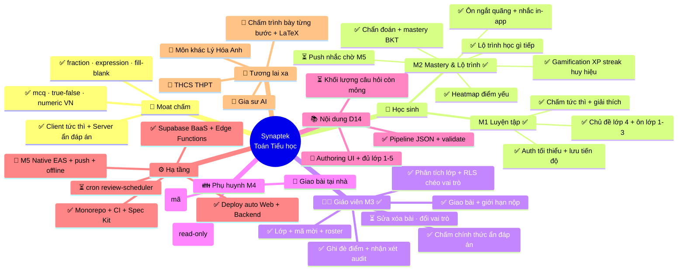
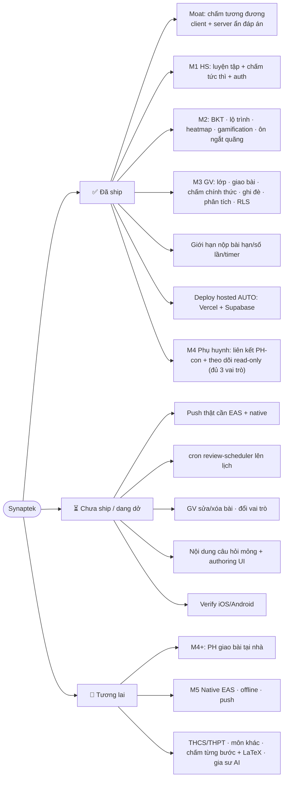

# Bản đồ chức năng (Feature Map)

> Tổng hợp chức năng Synaptek theo trạng thái. **✅ đã ship · ⏳ chưa ship/dang dở · 🔮 tương lai.**
> Nguồn chi tiết: `docs/02-roadmap.md` (milestone) · `docs/00-architecture.md §0` (Decision Log) · `docs/WORKING-NOTES.md` (điểm tiếp tục).

## Mindmap

## Theo trạng thái (flowchart)

## Chú thích trạng thái

| Ký hiệu | Nghĩa                                                                       |
| ------- | --------------------------------------------------------------------------- |
| ✅      | Đã ship (đã làm + test/verify; phần lớn đã merge `develop` + deploy hosted) |
| ⏳      | Chưa ship hoặc dang dở (đã có nền nhưng chưa hoàn thiện / chờ điều kiện)    |
| 🔮      | Tương lai (chưa bắt đầu)                                                    |

### Ghi chú "⏳ dang dở" — vì sao chưa làm

- **Push thật + cron**: gắn với app native (token push). Web-only hiện chưa có token → hoãn **M5**.
- **Nội dung câu hỏi**: mới ~21 câu — Rủi ro #1 (khối lượng + bản quyền). Cần biên soạn thêm; authoring UI để M4.
- **GV sửa/xóa bài, đổi vai trò trong hồ sơ**: tính năng nhỏ, bổ sung khi cần.
- **iOS/Android**: mới verify trên web; native kiểm ở M5.
